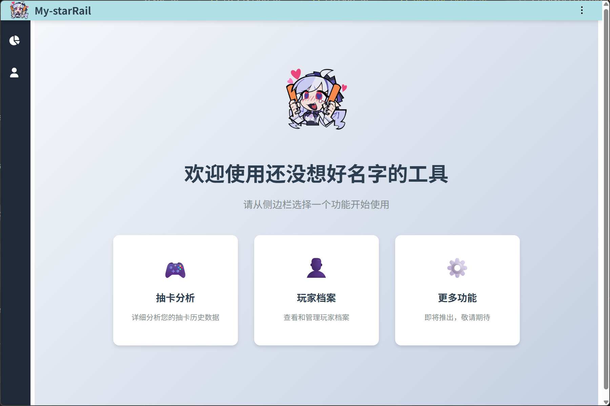

# 🌠 星穹铁道抽卡分析工具 StarRail Gacha Analyzer

<div align="right">
  <a href="README.zh-CN.md">简体中文</a> | <a href="README.md">English</a>
</div>


A desktop application for analyzing Honkai: Star Rail gacha logs locally.

## 📖 Usage

**Prerequisite**: Ensure that within the last 24 hours, you have run Honkai: Star Rail on the device where this tool is installed and viewed the gacha history for the account you wish to query.

1. Wait for the program to launch, select or enter the target UID, click the `开始分析` button,
2. wait for the analysis to complete, then click any item in the gacha record list to view detailed information.

P.S.: I forgot to handle port conflicts. Before launching, check if any other program is using port 3168.
P.P.S.: 3168 is the first four digits of my QQ number.

## 🖼️ Screenshots




## ✨ Features

- Automatically extract gacha URLs from log files
- Analyze 5★ statistics, pity counts, etc.
- Local database with multi-UID support


## 🛠️ Tech Stack

- Frontend: Vue 3 + Vite
- Backend: NestJS + TypeORM + SQLite
- Desktop: Electron + electron-builder

## 🚀 Getting Started

Download from [Releases](https://github.com/SpacervalLam/StarRail-toolkit/releases)

- **Portable Version**: Download and unzip the file `My-starRail. 1.0.0. zip` to any directory, and run `My-starRail. exe`
- **Installer Version**: Run `My-starRail.Setup.1.0.0.exe`,Follow the steps to complete the installation.  


## 🌐 Languages

- 中文 (default)
- English
- 日本語

## 🧩 Development & Build

```bash
npm install
npm run start:dev     # start dev server

npm run dist:win      # build for windows
npm run dist:mac      # build for mac
npm run dist:linux    # build for linux
````

## 📝 Changelog

See [CHANGELOG.md](./CHANGELOG.md)

## 📄 License

MIT License © 2025 [SpacervalLam](https://github.com/SpacervalLam/StarRail-toolkit/blob/main/LICENSE) 


