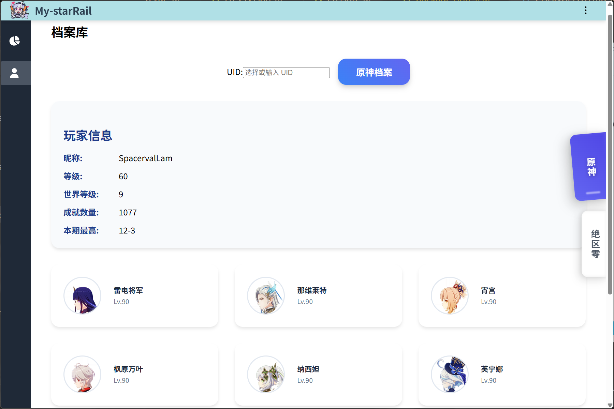

# 🌠 米哈游抽卡分析工具 miHoYo Gacha Analyzer

<div align="right">
  <a href="README.zh-CN.md">简体中文</a> | <a href="README.md">English</a>
</div>

A desktop application for analyzing **Honkai: Star Rail**, **Zenless Zone Zero**, and **Genshin Impact** gacha and player data **locally**.

---

## 📖 Usage

**Prerequisite**: Within the last 24 hours, you must have run the game and viewed the relevant in-game data on the same device.

### ✅ Honkai: Star Rail / Zenless Zone Zero

1. Launch the app, select or input the target UID, click the `analyze` button.
2. Wait for the analysis to complete. Click any item in the list to view detailed information.

> ⚠️ Port 3168 is hardcoded; please ensure no other applications are occupying it.
> (Yes, it's the first 4 digits of my QQ number 😅)

### ✅ Genshin Impact

1. Make sure the character whose data you want to query is placed in the **profile showcase** within the game.
2. Open the app and navigate to the Genshin Impact section to fetch player stats (e.g., character builds, levels, weapons).

---

## 🖼️ Screenshots

> 📸 preview slots reserved:


 
 

---

## ✨ Features

* 🔍 Automatically extract gacha URLs from log files (Star Rail / ZZZ)
* 📊 Analyze 5★ statistics, pity counts, history, and more
* 📁 Local database with multi-UID support
* 🎮 Genshin Impact player stat viewer (via profile showcase)
* 💬 Multilingual interface (中文 / English / 日本語)

---

## 🛠️ Tech Stack

* **Frontend**: Vue 3 + Vite
* **Backend**: NestJS + TypeORM + SQLite
* **Desktop**: Electron + electron-builder

---

## 🚀 Getting Started

Download from [Releases](https://github.com/SpacervalLam/StarRail-toolkit/releases)

* **Portable Version**: Unzip `My-starRail.1.0.0.zip`, then run `My-starRail.exe`
* **Installer Version**: Run `My-starRail.Setup.1.0.0.exe` and follow the steps

---

## 🌐 Languages

* 中文 (默认)
* English
* 日本語

---

## 🧩 Development & Build

```bash
npm install
npm run start:dev     # start dev server

npm run dist:win      # build for Windows
npm run dist:mac      # build for macOS
npm run dist:linux    # build for Linux
```

---

## 📝 Changelog

See [CHANGELOG.md](./CHANGELOG.md)

---

## 📄 License

MIT License © 2025 [SpacervalLam](https://github.com/SpacervalLam/StarRail-toolkit/blob/main/LICENSE)

---
