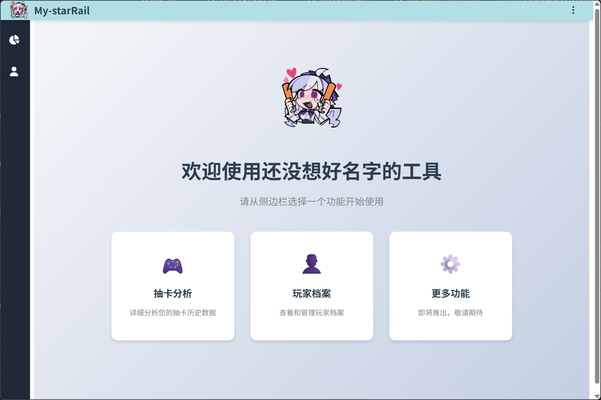

# 🌠 星穹铁道抽卡分析工具 StarRail Gacha Analyzer

<div align="right">
  <a href="README.zh-CN.md">简体中文</a> | <a href="README.md">English</a>
</div>


一个用于本地分析《崩坏：星穹铁道》抽卡记录的桌面应用程序。

## 📖 使用方法

**前提条件**：确保在安装了本工具的设备上，您在过去24小时内运行过《崩坏：星穹铁道》游戏，并查阅过待查询账号的抽卡历史记录。

1. 等待程序启动，选择或输入待查询的 UID，点击 `开始分析` 按钮，
2. 等待分析完成，点击抽卡记录列表中的任意一项，查看详细信息

ps: 忘了处理端口冲突了，打开前看看有没有其他程序占用了 3168 端口。
pps: 3168 是我QQ号前四位

## 🖼️ 截图





## ✨ 功能特点

- 自动从日志文件中提取抽卡链接
- 分析五星出货、保底、抽数统计等信息
- 本地数据库，支持多个 UID

## 🛠️ 技术栈

- 前端：Vue 3 + Vite
- 后端：NestJS + TypeORM + SQLite
- 桌面端：Electron + electron-builder

## 🚀 安装与运行

从 [Releases](https://github.com/SpacervalLam/StarRail-toolkit/releases) 页面下载
- **绿色版**：下载并解压`My-starRail.1.0.0.zip`到任意目录，运行 `My-starRail.exe`
- **安装版**：运行 `My-starRail.Setup.1.0.0.exe` ，根据提示完成安装

## 🌐 语言

- 中文（默认）
- English
- 日本語

## 🧩 开发与构建

```bash
npm install
npm run start:dev     # 启动开发环境

npm run dist:win      # 在 Windows 上构建安装包
npm run dist:mac      # 在 macOS 上构建安装包
npm run dist:linux    # 在 Linux 上构建安装包
````

## 📝 更新日志

请参阅 [更新日志](./CHANGELOG.md)

## 📄 许可证

MIT License © 2025 [SpacervalLam](https://github.com/SpacervalLam/StarRail-toolkit/blob/main/LICENSE) 